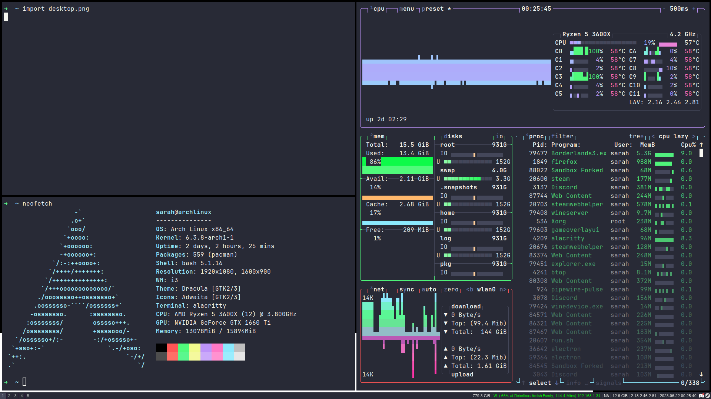

# My Dotfiles

These are my arch i3 desktop config files, I use this repo to sync my laptop and desktop machines.

if you'd like to run my setup you can clone this repo and use the install script

To install these files you can run the provided script, it installs packages and if needed, the Paru aur helper.
If you want a wallpaper to be set to restore on new sessions place a `wallpaper.png` file in your `~/.config` directory or the cloned repo before running the script
